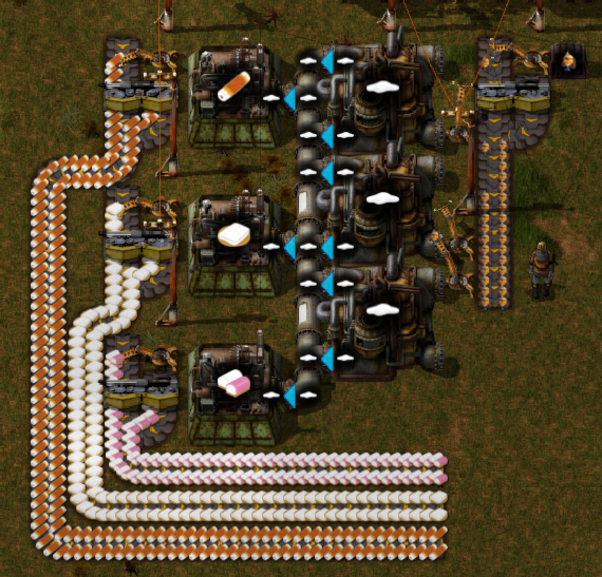

# Factorio Surimi MOD

Bring surimi's light to the devastated world.

## Parameters

|Name|HP|HP Rate|Stack|Cooldown|Used Fish|memo|
|---|--:|--:|--:|--:|--:|---|
|Raw Fish|80|1|100|x 1.0|1|for comparision|
|Hanpen|40|0.5|100|x 1.0|0.5|water needed|
|Kamaboko|80|1|100|x 0.75|0.75|wood and steam needed|
|Chikuwa|80|1|100|x 0.5|1||

## Complements
I recommend to use other mod for gathering fish like [Versepelles Aquafarm](https://mods.factorio.com/mod/VersepellesAquaFarm015) or [Food Industry 2 (beta)](https://mods.factorio.com/mod/FoodIndustry).

## Planned features
- Food buf

## Thanks
http://www.irasutoya.com/
